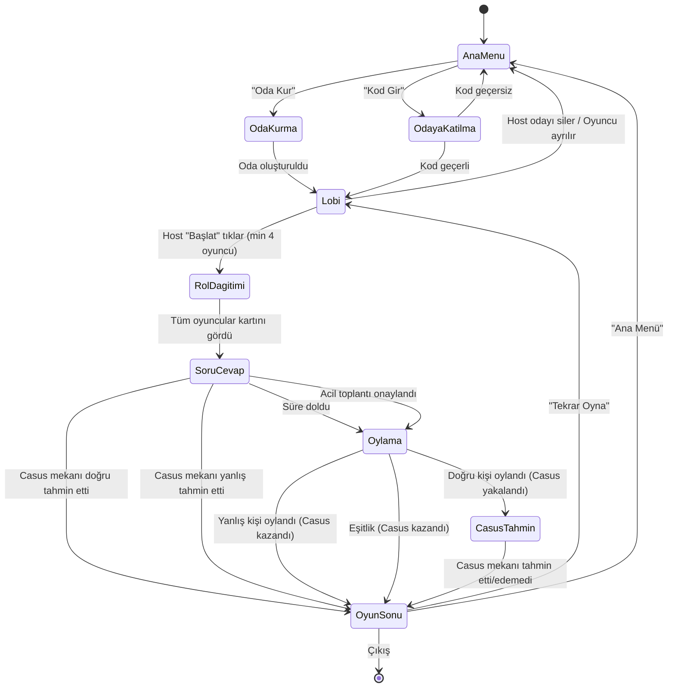

# 🔄 Aramızdaki Casus - Oyun Durumları (State Machine)

## 1. Durum Diyagramı



---

## 2. Durum Detayları

### 2.1 `IDLE` - Ana Menü

**Giriş Koşulu:** Uygulama açıldığında veya oyundan çıkıldığında.

| Özellik | Değer |
|---------|-------|
| **Firestore Durumu** | Herhangi bir room dökümanına bağlı değil |
| **Kullanıcı Aksiyonları** | "Oda Kur", "Odaya Katıl", "Nasıl Oynanır?" |
| **Geçiş Tetikleyicileri** | Buton tıklamaları |

---

### 2.2 `LOBBY` - Lobi / Bekleme Odası

**Giriş Koşulu:** Oda oluşturulduğunda veya geçerli kodla katılıldığında.

| Özellik | Değer |
|---------|-------|
| **Firestore Durumu** | `rooms/{roomId}.status = "lobby"` |
| **Görüntülenenler** | Oyuncu listesi, Oda kodu, Ayarlar (sadece Host) |
| **Host Aksiyonları** | Süre ayarlama, Oyunu başlatma, Oyuncu çıkarma |
| **Oyuncu Aksiyonları** | İsim değiştirme, Odadan ayrılma |
| **Çıkış Tetikleyicileri** | Host "Başlat" butonuna tıklar (min 4 oyuncu) |

**Lobi Business Rules:**
- Oyuncu sayısı 4'ün altına düşerse "Başlat" butonu devre dışı kalır.
- Host odadan ayrılırsa, listedeki bir sonraki oyuncu otomatik Host olur.
- Oyun başladıktan sonra yeni oyuncu katılamaz.

---

### 2.3 `ROLE_REVEAL` - Rol Gösterimi

**Giriş Koşulu:** Host oyunu başlattığında.

| Özellik | Değer |
|---------|-------|
| **Firestore Durumu** | `rooms/{roomId}.status = "role_reveal"` |
| **Sunucu İşlemleri** | Mekan seçimi, Casus atama, Rol dağıtımı |
| **Oyuncu Ekranı** | Kart animasyonu ile rol gösterimi |
| **Çıkış Tetikleyicisi** | Tüm oyuncuların `hasSeenRole = true` |

**Güvenlik Kuralları:**
- Her oyuncu sadece kendi rolünü görebilir.
- Rol bilgisi Firestore'da oyuncunun kendi alt dökümanında saklanır.
- Client tarafında başka oyuncuların rolü sorgulanamaz.

---

### 2.4 `INTERROGATION` - Soru-Cevap Turu

**Giriş Koşulu:** Tüm oyuncular rolünü gördüğünde.

| Özellik | Değer |
|---------|-------|
| **Firestore Durumu** | `rooms/{roomId}.status = "interrogation"` |
| **Zamanlayıcı** | Host'un belirlediği süre (180s / 300s / 480s) |
| **Aktif Oyuncu** | Soru sorma sırası olan oyuncu |
| **UI Elementleri** | Zamanlayıcı, Oyuncu listesi, Sıra göstergesi, "Acil Toplantı" butonu |

**Sıra Mantığı:**
```
1. İlk soru soran: Rastgele seçilir
2. A oyuncusu B'ye sorar → B cevaplar
3. B, A hariç herkese soru sorabilir → B, C'ye sorar
4. C, B hariç herkese soru sorabilir → C, D'ye sorar
5. Devam eder...
```

**Casus Aksiyonları:**
- "Mekanı Tahmin Et" butonu her zaman casus'un ekranında görünür.
- Tahmin yapıldığında popup ile mekan listesi gösterilir.

**Acil Toplantı Mantığı:**
```
1. Oyuncu "Acil Toplantı" butonuna basar
2. Diğer oyunculara bildirim gider
3. Oyuncu sayısının yarısından fazlası (>50%) onaylarsa oylama başlar
4. 15 saniye içinde yeterli onay gelmezse istek düşer
```

---

### 2.5 `VOTING` - Oylama

**Giriş Koşulu:** Süre dolduğunda veya acil toplantı onaylandığında.

| Özellik | Değer |
|---------|-------|
| **Firestore Durumu** | `rooms/{roomId}.status = "voting"` |
| **Süre Limiti** | 30 saniye |
| **Görüntülenenler** | Oyuncu listesi (oy verilebilir), Geri sayım |
| **Oylama Kuralı** | Her oyuncu bir kişiyi seçer (kendini seçemez) |

**Oylama Sonuç Hesaplama:**
```
1. Tüm oylar toplandıktan sonra veya 30 sn dolduktan sonra sonuç hesaplanır
2. Oy kullanmayan oyuncuların oyu "Pas" sayılır
3. En çok oyu alan kişi belirlenir
4. Eşitlik varsa → Kimse seçilmez → Casus kazanır
5. Seçilen kişi Casus ise → CasusTahmin aşamasına geç
6. Seçilen kişi Casus değilse → Casus kazanır → OyunSonu
```

**2 Casuslu Oyunda:**
```
1. İlk oylama yapılır
2. Biri casus ise → Kart açılır, ikinci oylama yapılır
3. Biri casus değilse → Her iki casus kazanır → OyunSonu
4. İkinci oylamada diğer casus da yakalanırsa → Casusların son tahmin hakkı
```

---

### 2.6 `SPY_GUESS` - Casus'un Son Tahmini

**Giriş Koşulu:** Oylama sonucunda casus doğru bir şekilde seçildiğinde.

| Özellik | Değer |
|---------|-------|
| **Firestore Durumu** | `rooms/{roomId}.status = "spy_guess"` |
| **Süre Limiti** | 30 saniye |
| **Casus Ekranı** | Tüm mekan listesi (seçim yapılabilir) |
| **Diğer Oyuncular** | "Casus tahmin yapıyor..." bekleme ekranı |

---

### 2.7 `GAME_OVER` - Oyun Sonu

**Giriş Koşulu:** Kazanan belirlendiğinde.

| Özellik | Değer |
|---------|-------|
| **Firestore Durumu** | `rooms/{roomId}.status = "game_over"` |
| **Görüntülenenler** | Kazanan taraf, Tüm roller açık, Mekan bilgisi, Puanlar |
| **Butonlar** | "Tekrar Oyna", "Lobiye Dön", "Ana Menü" |

---

## 3. Firestore Room Durumları (Status Enum)

```javascript
const ROOM_STATUS = {
  LOBBY: 'lobby',           // Oyuncular bekleniyor
  ROLE_REVEAL: 'role_reveal', // Roller gösteriliyor
  INTERROGATION: 'interrogation', // Soru-cevap turu
  VOTING: 'voting',          // Oylama süreci
  SPY_GUESS: 'spy_guess',    // Casus son tahmin
  GAME_OVER: 'game_over',    // Oyun bitti
};
```

---

## 4. Zamanlayıcı (Timer) Yönetimi

| Aşama | Süre | Davranış |
|-------|------|----------|
| Rol Gösterimi | Maks 30sn (auto) | Tüm oyuncular "Gördüm" derse erken biter |
| Soru-Cevap | 3 / 5 / 8 dk (ayarlanabilir) | Süre dolunca otomatik oylama |
| Oylama | 30sn | Süre dolunca oy kullanmayanlar "Pas" |
| Casus Tahmini | 30sn | Süre dolunca tahmin yapamaz → Masumlar kazanır |

> [!IMPORTANT]
> Zamanlayıcı **sunucu tarafında** (Firebase server timestamp) yönetilmelidir. Client tarafı sadece gösterim amaçlıdır. Bu, hile yapılmasını önler.
