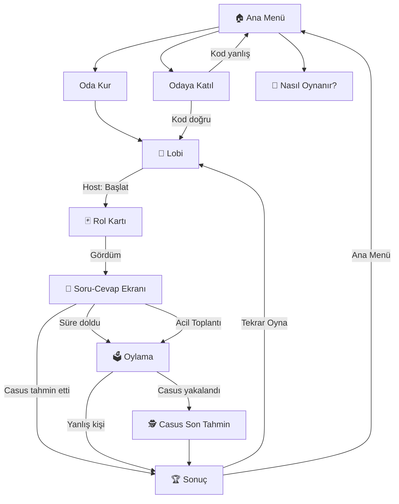

# 🎨 Aramızdaki Casus - UI/UX Akışı

## 1. Ekran Listesi

| # | Ekran | Durum |
|---|-------|-------|
| 1 | Ana Menü | `IDLE` |
| 2 | Oda Kurma | Geçiş |
| 3 | Odaya Katılma | Geçiş |
| 4 | Lobi | `LOBBY` |
| 5 | Rol Kartı | `ROLE_REVEAL` |
| 6 | Oyun Ekranı (Soru-Cevap) | `INTERROGATION` |
| 7 | Acil Toplantı Popup | `INTERROGATION` içinde |
| 8 | Mekan Tahmin Popup (Casus) | `INTERROGATION` içinde |
| 9 | Oylama Ekranı | `VOTING` |
| 10 | Casus Son Tahmin | `SPY_GUESS` |
| 11 | Sonuç Ekranı | `GAME_OVER` |
| 12 | Nasıl Oynanır | Modal |

---

## 2. Ekran Akış Diyagramı

---

## 3. Ekran Detayları

### 3.1 🏠 Ana Menü

**Elementler:**
- Oyun logosu ve başlığı (animasyonlu)
- "Oda Kur" butonu (büyük, primary)
- "Odaya Katıl" butonu (secondary)
- "Nasıl Oynanır?" linki
- Karanlık/aydınlık mod toggle

**Tasarım Notları:**
- Casus temalı koyu renk paleti (koyu lacivert, altın, kırmızı)
- Arka planda hafif partiküller veya duman animasyonu
- Mobil-first responsive tasarım

---

### 3.2 👥 Lobi Ekranı

**Elementler:**
- Oda kodu (büyük, kopyalanabilir)
- Oyuncu listesi (avatar + isim, bağlantı durumu ikonu)
- Ayarlar paneli (sadece Host görür): Süre seçici (3/5/8 dk)
- "Oyunu Başlat" butonu (sadece Host, min 4 oyuncu)
- "Ayrıl" butonu

**Etkileşimler:**
- Yeni oyuncu katıldığında liste animasyonlu güncellenir
- Oda kodu tıklanınca panoya kopyalanır
- Host: Oyuncu isminin yanındaki ✕ ile çıkarma

---

### 3.3 🃏 Rol Kartı Ekranı

**Elementler:**
- Kart flip animasyonu ile rol gösterimi
- **Masum:** Mekan emojisi + adı + Rol adı
- **Casus:** "🕵️ SEN CASUSSUN!" büyük kırmızı yazı
- "Gördüm" butonu (5 sn sonra aktif olur)
- Geri sayım (tüm oyuncuları bekleme)

**Tasarım:**
- Kart ortada, 3D flip animasyonu
- Casusun kartı kırmızı tonlarında, masumların kartı yeşil/mavi
- Kart el ile çevrilebilir (touch gesture)

---

### 3.4 🎤 Soru-Cevap Ekranı

**Elementler:**
- Üstte: Geri sayım zamanlayıcısı (büyük, belirgin)
- Ortada: Oyuncu listesi (dairesel avatarlar)
- Aktif soru soran oyuncu vurgulanır (parlayan border)
- Soru sorulan oyuncu seçim butonu (sıradaki oyuncu seçer)
- Alt kısım: "Acil Toplantı 🚨" butonu
- **Sadece casus görür:** "Mekanı Tahmin Et 🎯" butonu

**Etkileşimler:**
- Sıradaki oyuncu, bir avatara tıklayarak "soru sorduğu" kişiyi seçer
- Seçim yapıldığında sıra otomatik geçer
- Timer son 30 sn'de kırmızıya döner ve yanıp söner

---

### 3.5 🗳️ Oylama Ekranı

**Elementler:**
- "Casusu seçin!" başlığı
- Oyuncu kartları listesi (tıklanabilir)
- 30 sn geri sayım
- Seçimi onaylama butonu
- Oy durumu göstergesi: "5/8 oy kullanıldı"

**Etkileşimler:**
- Oyuncu seçildiğinde kart vurgulanır
- "Oyu Gönder" butonu ile oylama kesinleşir
- Tüm oylar tamamlanınca dramatik "kart açılma" animasyonu

---

### 3.6 🕵️ Casus Son Tahmin Ekranı

**Elementler (Casus):**
- "SON ŞANSIN!" başlığı
- Tüm mekanların listesi (grid/karusel)
- 30 sn geri sayım
- Seçim ve onay butonu

**Elementler (Diğerleri):**
- "Casus son tahminini yapıyor..." bekleme ekranı
- Gerilim müziği/animasyonu

---

### 3.7 🏆 Sonuç Ekranı

**Elementler:**
- Kazanan taraf: Konfeti animasyonu (masumlar kazandıysa), kırmızı duman (casus kazandıysa)
- Mekan bilgisi açıklanır
- Tüm oyuncuların rolleri açıkça gösterilir
- Casusun kim olduğu vurgulanır
- Puan tablosu (birden fazla tur oynandıysa)
- "Tekrar Oyna" ve "Lobiye Dön" butonları

---

## 4. Tema ve Renk Paleti

| Element | Renk Kodu | Kullanım |
|---------|-----------|----------|
| **Primary BG** | `#0f0f23` | Ana arka plan (koyu gece mavisi) |
| **Secondary BG** | `#1a1a3e` | Kart ve panel arka planları |
| **Accent Gold** | `#ffd700` | Başlıklar, önemli vurgular |
| **Spy Red** | `#e63946` | Casus kartı, uyarılar |
| **Innocent Green** | `#2ecc71` | Masum kartı, onay |
| **Text Primary** | `#f5f5f5` | Ana metin |
| **Text Muted** | `#888899` | İkincil metin |
| **Glass Effect** | `rgba(255,255,255,0.05)` | Glassmorphism kartlar |

**Fontlar:**
- Başlıklar: `Outfit` veya `Poppins` (Google Fonts)
- Gövde: `Inter` (Google Fonts)

---

## 5. Responsive Tasarım Kuralları

| Breakpoint | Hedef |
|------------|-------|
| `< 480px` | Mobil (dikey) - **Öncelikli** |
| `480-768px` | Tablet / Büyük mobil |
| `> 768px` | Desktop |

- Tüm ekranlar **mobil-first** tasarlanır
- Lobi ve oyun ekranları dikey yönlendirmede çalışır
- Butonlar minimum **48px** yüksekliğinde (parmak dokunma)
- Metin minimum **16px** (okunabilirlik)

---

## 6. Animasyonlar

| Animasyon | Nerede | Tip |
|-----------|--------|-----|
| Kart Flip | Rol gösterimi | CSS 3D Transform |
| Pulse | Aktif oyuncu | CSS Animation |
| Fade In/Out | Ekran geçişleri | CSS Transition |
| Confetti | Oyun sonu (masumlar kazanır) | Canvas/JS |
| Shake | Timer son 10 sn | CSS Animation |
| Glow | Casus butonu | CSS Box-Shadow Animation |
| Slide Up | Popup/Modal | CSS Transform |
